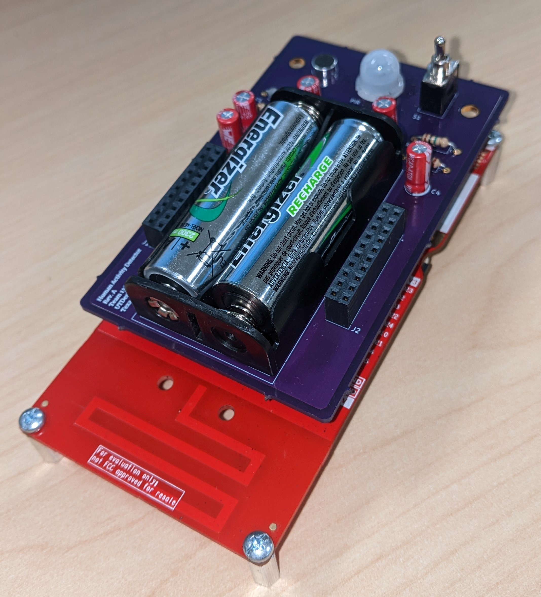

# Embedded Wi-SUN Proof of Concept

## Background

This application is built on top of TI's Wi-SUN stack to provide the user with sound and motion data from a network of nodes that support CoAP requests to `/mic` and `/pir` URIs. This application was developed by a 2021-2022 UTDesign team along with the corresponding hardware to capture the sound and motion data.

<div align="center" >
    
</div>

Although not shown in the code from this repository, the data captured was pushed to a cloud-based time-series database, which was then used to populate and visualize the data in a publicly hosted website *(This would be relatively simple to add if desired)*.

## Running

**Important Notes**

This application is built on top of the ti-wisun-webapp that comes with TI's wfantund *(This application derives the topology of the network from `http://localhost:80/topology`)*. If the port or IP of the ti-wisun-webapp is different, it can be configured by setting the TOPOLOGY_ROUTE. Also, if it is truly desired to remove the  dependency on the ti-wisun-webapp, the developer can use the wfantund D-BUS API to fetch the connected devices for polling *(Example JS-based D-Bus communication is found inside the ti-wisun-webapp)*.

In the `/server` directory, first install all the node packages with:
```
npm install
```

Then, while still in `/server`, running this application is as simple as running:
```
node index.js
```

## Configuration

If a specific polling interval for the sound and motion data is desired, DATA_POLL_INTERVAL can be set to the number of milliseconds between each data poll *(Default: 5000ms)*. It is important to note that this interval is only a lower limit. Due to some nodes timing out, each interval could be longer than this interval, but it won't be shorter.
